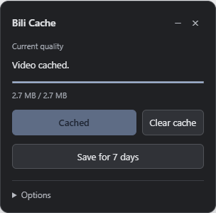

# Bili Cache

Cache Bilibili videos in Edge or Chrome. Play downloaded parts as they arrive, or save a complete video for 7 days.

[Download](https://github.com/QingrongY/bili-page-cache/releases/latest)

## Install

1. Download the release ZIP and extract it.
2. Open `edge://extensions` or `chrome://extensions` and turn on **Developer mode**.
3. Click **Load unpacked** and select the **extension** folder.

## Use

1. Open a Bilibili video, select a fixed quality, and play for a few seconds.
2. Open Bili Cache from the toolbar and click **Enable on this tab**.
3. Click **Cache video**. You can pause playback while it downloads.

Downloaded parts are available during playback. Seeking ahead of the cache uses the network. Direct MP4 playback switches to the cache when the download finishes.

Open **Options** to change download connections or server selection.

## Save a video

Click **Save for 7 days** after the download finishes. The panel shows the expiry date once the copy is saved. To play it later, open the same video, select the same quality and audio track, and enable Bili Cache.

**Clear cache** clears the current tab. **Delete saved** removes its saved copy. The toolbar popup shows total saved storage and has a **Delete all saved videos** button.

Unsaved data is cleared when the tab closes. Saved copies expire after 7 days; cleanup runs every 30 minutes and at browser startup.

## Update

Keep the installation folder in place. Replace its files with the new release and click **Reload** on the extensions page. Close and reopen the cache panel to update an existing tab.
